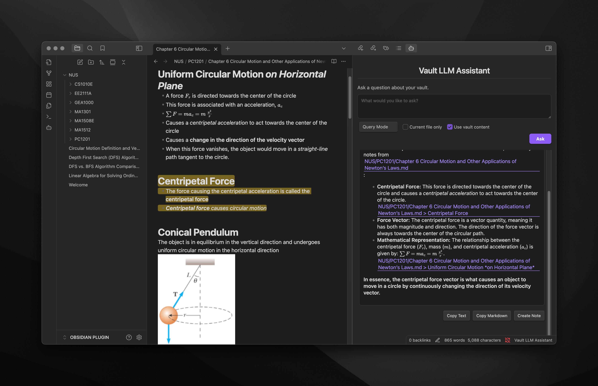
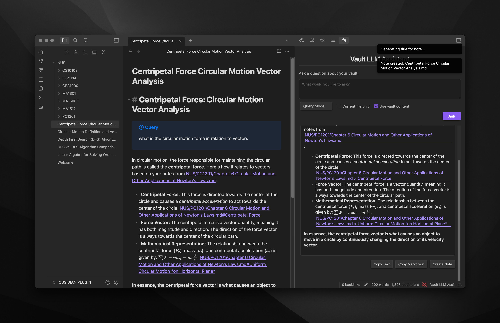

# <div align="center">Vault LLM Assistant for Obsidian</div>

<div align="center">
Query your Obsidian vault using AI, get contextual answers with proper citations, and create new notes on specific topics.
</div>

<br />

<div align="center">
  <a href="https://github.com/brianstm/obsidian-vault-llm-assistant/releases">
    
  </a>
</div>

## Features

-   Ask questions about your vault's content and get AI-generated answers
-   Create comprehensive notes on any topic with optional vault context integration
-   Toggle between Query mode and Create mode with a simple dropdown
-   Choose whether to include vault content in your prompts
-   Results include citations and links back to your original notes
-   Copy results as text or markdown with one click
-   Create new notes from responses with AI-generated titles
-   Support for OpenAI GPT and Google Gemini models
-   Configure which files and folders to include or exclude from scanning
-   Highlight and copy results easily

## Screenshots





## Installation

### From Obsidian Community Plugins

1. Open Obsidian Settings → Community Plugins
2. Disable Safe Mode if necessary
3. Click "Browse" and search for "Vault LLM Assistant"
4. Click Install and enable the plugin

### Manual Installation

1. Download the latest release from the [GitHub releases page](https://github.com/brianstm/obsidian-vault-llm-assistant/releases/)
2. Extract the ZIP file to your vault's `.obsidian/plugins/` directory
3. Restart Obsidian and enable the plugin in Settings → Community Plugins

### Required Dependencies

After installation, install the required dependencies:

```bash
cd [your-vault]/.obsidian/plugins/obsidian-vault-llm-assistant
npm install
```

## Usage

### Basic Usage

1. Click the Vault LLM Assistant icon in the left sidebar ribbon
2. Select your desired mode from the dropdown (Query or Create)
3. Optionally toggle "Use vault content" to include or exclude your vault's content in prompts
4. Type your question or topic
5. Click "Ask" (in Query mode) or "Create" (in Create mode) or press Ctrl+Enter (Cmd+Enter on Mac)
6. View the AI-generated response with citations to your notes

### Modes

-   **Query Mode**: Ask questions about your vault's content and get AI-generated answers
-   **Create Mode**: Generate comprehensive notes on any topic, with or without using your vault content as context

### Response Actions

After receiving a response, you can:

-   **Highlight and copy text**: Select text normally as the response is fully selectable
-   **Copy Text**: Click the "Copy Text" button to copy the response as plain text
-   **Copy Markdown**: Click the "Copy Markdown" button to copy the response with markdown formatting
-   **Create Note**: Click the "Create Note" button to save the response as a new note in your vault

### Configuration Options

Access plugin settings via Settings → Community Plugins → Vault LLM Assistant:

-   **LLM Provider**: Choose between OpenAI GPT and Google Gemini
-   **API Key**: Enter your API key for the selected provider
-   **Model**: Select which AI model to use
-   **Max Tokens & Temperature**: Control response length and creativity
-   **Use Vault Content in Prompts**: Toggle whether to include vault content in AI prompts
-   **Mode**: Select the current mode (Query or Create)
-   **Default Folder for New Notes**: Set where new notes will be saved
-   **Generate Note Titles with LLM**: Toggle whether to use AI for generating note titles
-   **Include/Exclude Folders**: Specify which folders to include or exclude from scanning

## API Keys

-   **OpenAI**: Get your API key from [OpenAI Platform](https://platform.openai.com/api-keys)
-   **Google Gemini**: Get your API key from [Google AI Studio](https://aistudio.google.com/app/prompts/new_chat)

## Local Development

To set up for local development:

```bash
# Clone the repository
git clone https://github.com/brianstm/obsidian-vault-llm-assistant.git

# Enter the project directory
cd obsidian-vault-llm-assistant

# Install dependencies
npm install

# Start development server with hot-reload
npm run dev
```

## Troubleshooting

If you encounter issues:

1. Verify your API key is correct and active
2. Check that you've installed all dependencies with `npm install`
3. Ensure your API key has access to the models you've selected
4. Check console logs for specific error messages (Ctrl+Shift+I in Obsidian)

## License

This project is licensed under the [MIT License](LICENSE).

## Credits

-   Developed by [Brians Tjipto](https://github.com/brianstm)
-   Website: [brianstjipto.xyz](https://www.brianstjipto.xyz/)

---

If you find this plugin helpful, please consider starring the [GitHub repository](https://github.com/brianstm/obsidian-vault-llm-assistant)!
